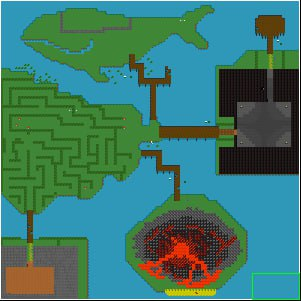
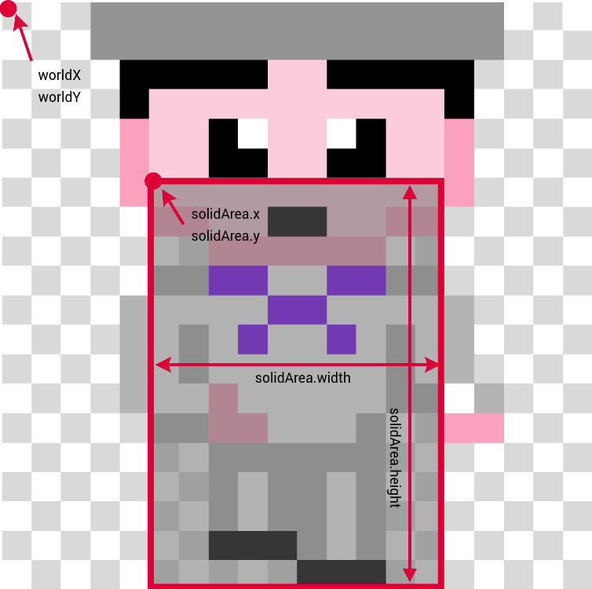
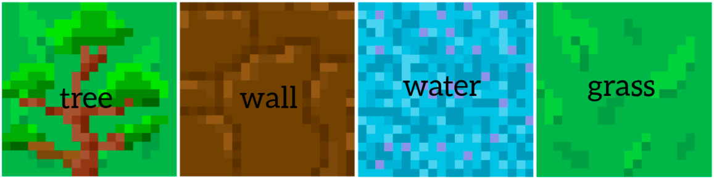
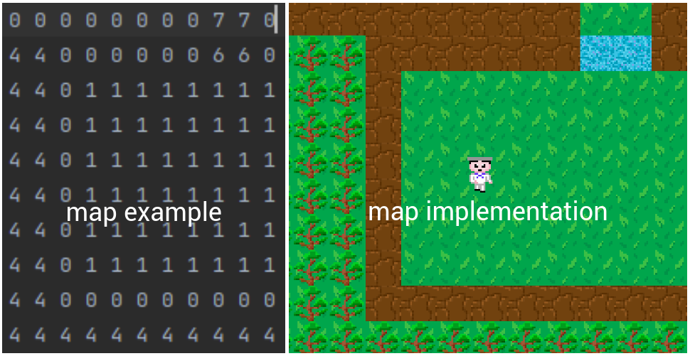
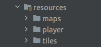
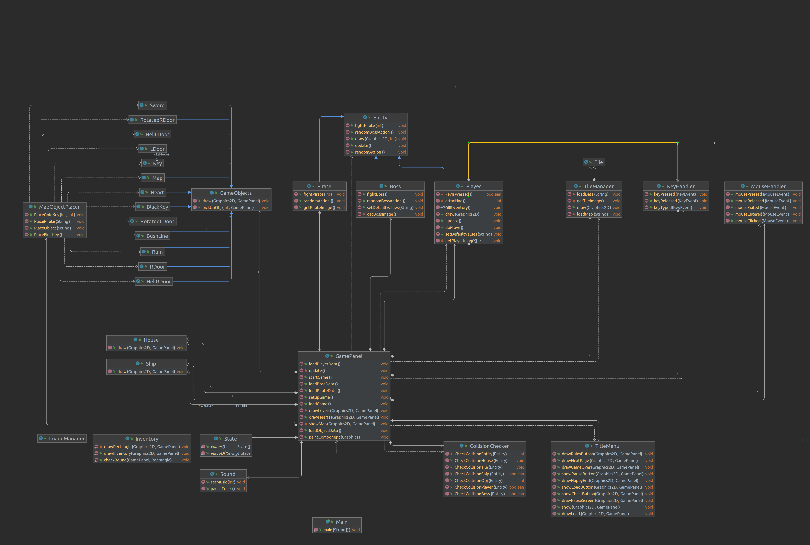
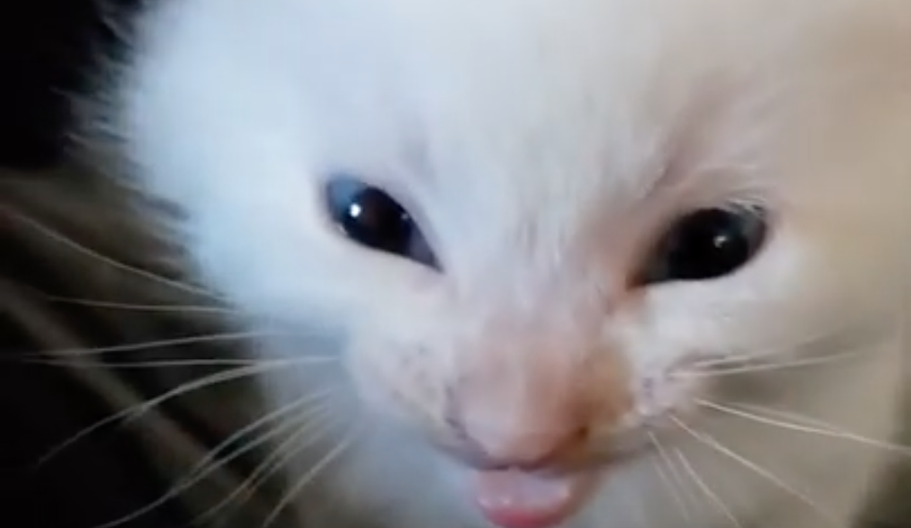

# The Sailor's Way ⛵

🟧 [Manuál pro uživatele](#manuál-pro-uživatele) | 🟦 [Program documentation](#program-documentation) | 🟩 [Important information](#important-information)

  

## Manual for users
+ [Running the game](#running-the-game)
+ [Title menu](#title-menu)
+ [Map](#map)
+ [Boss](#boss)

### Running the game 🎮

To run the game on your computer, you can follow the following steps:

1. Find the "Clone" button and copy the link to the repository.

2. To run the code, you need to download the IDE for the Java programming language. For example, IntelliJIDEA from JetBrains.

3. Open IntelliJIDEA and select "File" -> "New" -> "Project from Version Control" -> "Git".

4. In the "URL" field, paste the repository link you copied earlier.

5. Go to the cz.cvut.fel.pjv.main directory and open the Main class, then click the <kbd>run</kbd> button in the upper right corner. 

6. Then a window will open on the monitor and you can start playing.

### Title menu 📜 
A menu will appear in front of the user, where they can choose whether they want to start the game, read the game rules or quit the game.

During the game, the user can pause the game, see what is in his inventory, or save and quit the game.

### Map 🗺
Before starting the game, you can look at the map and the main journey stages:

### Boss 🏴‍☠️

As in almost all games, at the end of the journey you will meet the main enemy. If the player has made it to this point, they will try to fight the boss as well.

## 🟧 Good luck on your journey!

---------------
## Program documentation
+ [Code structure](#code-structure)
+ [List of images and other files](#list-of-images-and-other-files)
+ [Diagram](#diagram)
+ [Tests](#tests)
+ [Resources](#resources)
  
## 🟦 Code structure
### Package `main`
#### 🔷 Main class 

The Main class is the class for running the game. It contains one method, main, which is the entry point to the application.

#### 🔷 KeyHandler class
The class handles keyboard events.

#### 🔷 CollisionChecker class
The class is responsible for checking player collisions with map tiles.

#### 🔷 GamePanel class
The class that displays the game window contains the main game loop and is responsible for drawing the tiles and the player.

Methods:

+ `update()`: updates the game state.

+ `paintComponent(Graphics g)`: method called when redrawing the game panel, renders tiles and players.

+ `loadBossData()`, `loadPirateData()`, `loadObjectData()`, `loadPlayerData()` load the data and writes it into a JSON file.

+ `drawHearts()`, `drawLevels()` draws the number of lives of the player and his level.

+ `startGame()` starts the game by creating a Timer with a delay of 16 milliseconds.

+ `loadGame()` loads the game, player, objects, pirates and boss based on the downloaded files, and sets the game state to "GAME".

#### 🔷 ImageManager class
The ImageManager class is responsible for loading and storing the images used in the game.

#### 🔷 Inventory class
The Inventory class is responsible for managing and displaying the player's inventory in the game.

#### 🔷 MapObjectPlacer class
The class reads JSON files containing game object coordinates and places the objects on the map.

#### 🔷 Sound class
For playing sound effects and music tracks.

#### 🔷 TitleMenu class
The TitleMenu class represents the title screen menu of the game.
It displays the game options and images, allowing the player to navigate through the menu.

### Package `entity`
#### 🔷 Entity class
The Entity class represents an object in the game that can be displayed on the screen.

The variables `worldX` and `worldY` represent the coordinates of the object's location on the map. 

The class also contains a variable `solidArea` - a rectangle that represents the area of the object in which no collision with other objects can occur.

#### 🔷 Player class
The Player class represents a game character and is inherited from the Entity class.

### Package `tile`
#### 🔷 Tile and TileManager class
Examples of tile types:

Map example:

### Package `object`
#### 🔷 GameObjects class
The GameObjects class is the base class for creating game objects.

The classes `Door`, `Equipment`, `Heart`, `Key`, `Weapon` and others are inherited from the base class GameObjects and represent specific implementations of this class.

### Package `enemy`
#### 🔷 Boss class, Pirate class
Classes that represent the enemies in the game.

## 🟦 List of images and other files
All the necessary images, such as backgrounds, a world map, and sound effects are in the `resources` package and are then organized into folders by category.

## 🟦 Diagram
This diagram is a graphical representation of the project structure. It shows how the classes in the project are interconnected and how they interact with each other.

## 🟦 Tests
Unit tests for classes:
`BossTest`, `PlayerTest`, `CollisionCheckerTest`, `GameObjectsTest`

## 🟦 Resources 🧠
+ Stack Overflow: [stackoverflow.com](https://stackoverflow.com/) ,  [Java2D OpenGL](https://stackoverflow.com/questions/35641229/java2d-opengl-graphics-acceleration-not-working)

+ YouTube: [RyiSnow](https://www.youtube.com/@RyiSnow)

+ Kreslení obrázků: [PixilArt](https://www.pixilart.com/draw)

+ Java IDE: [IntelliJ IDEA](https://www.jetbrains.com/idea/)

+ UML diagramy: [itnetwork.cz](https://www.itnetwork.cz/navrh/uml/uml-domenovy-model-diagram) ,  [Gleek_](https://www.gleek.io/blog/class-diagram-arrows) ,  [Medium](https://paulrumyancev.medium.com/uml-class-diagram-arrows-guide-37e4b1bb11e)

+ Brain

---------------
## 🟩 Important information
The actual [Herbert](https://www.youtube.com/shorts/vpQ1OVmMCkY):

