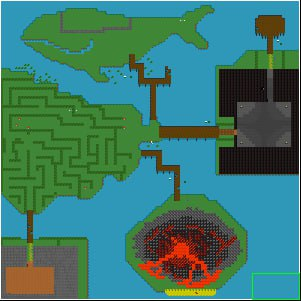

+ [Manuál pro uživatele](#manuál-pro-uživatele)
+ [Manuál pro uživatele](#manuál-pro-uživatele)
+ [Important information](#important-information)

# Manual for users
+ [Running the game](#running-the-game)
+ [Title menu](#title-menu)
+ [Map](#map)
+ [Boss](#boss)

## Running the game

To run the game on your computer, you can follow the following steps:

1. Find the "Clone" button and copy the link to the repository.

2. To run the code, you need to download the IDE for the Java programming language. For example, IntelliJIDEA from JetBrains.

3. Open IntelliJIDEA and select "File" -> "New" -> "Project from Version Control" -> "Git".

4. In the "URL" field, paste the repository link you copied earlier.

5. Go to the cz.cvut.fel.pjv.main directory and open the Main class, then click the <kbd>run</kbd> button in the upper right corner. 

6. Then a window will open on the monitor and you can start playing.

## Title menu
A menu will appear in front of the user, where they can choose whether they want to start the game, read the game rules or quit the game.

During the game, the user can pause the game, see what is in his inventory, or save and quit the game.

## Map
Before starting the game, you can look at the map and the main journey stages:

## Boss

As in almost all games, at the end of the journey you will meet the main enemy. If the player has made it to this point, they will try to fight the boss as well.

## Good luck on your journey!

---------------
## Important information
The actual [Herbert](https://www.youtube.com/shorts/vpQ1OVmMCkY):

